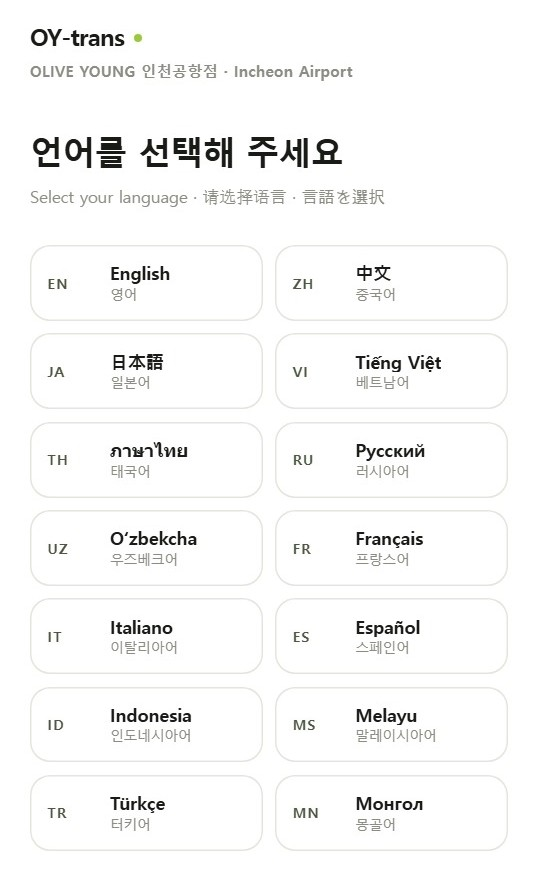
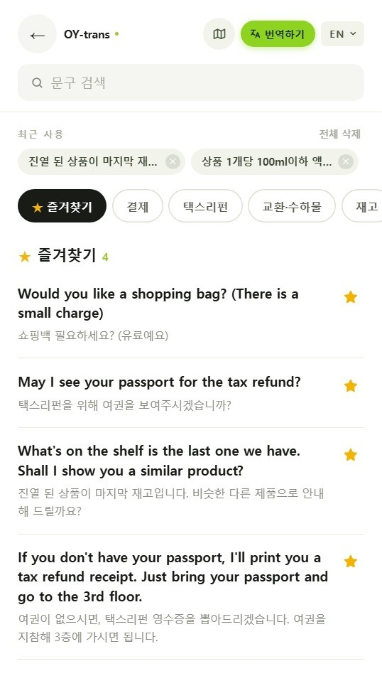
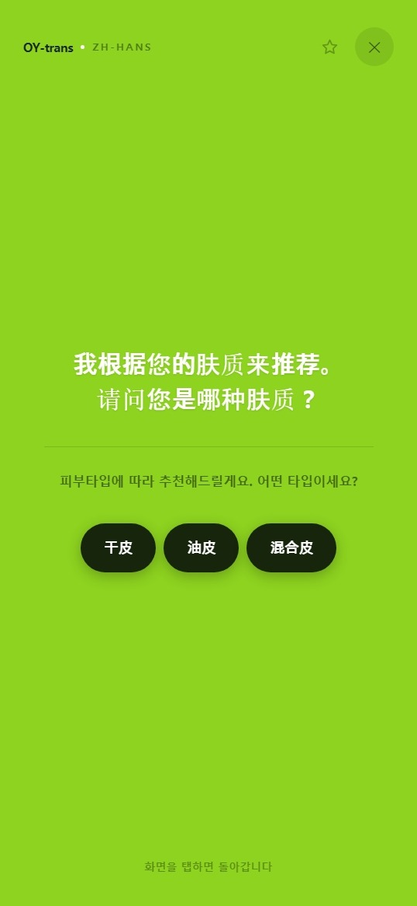
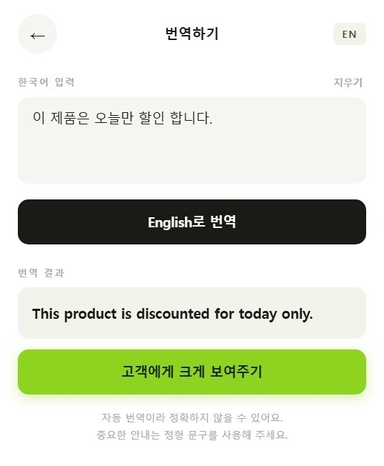
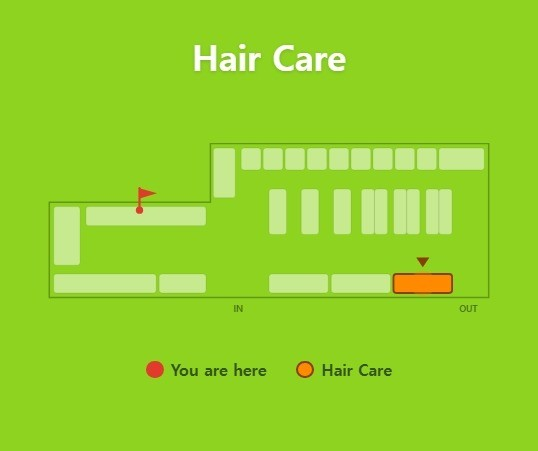

# 🌿 OY-trans

> 올리브영 인천공항점 크루를 위한 14개 언어 고객 응대 도구


---

## 📎 배포 링크

🔗 [OY-trans 바로가기](https://oy-trans.netlify.app)

모바일에서 접속 후 **홈 화면에 추가**하면 주소창 없이 앱처럼 실행됩니다.

---

## 💡 왜 만들었나

인천공항 올리브영은 다양한 국적의 고객이 오가는 매장입니다. 인사와 기본 안내는 익힌 표현으로 충분하지만, **택스리펀과 기내반입 규정**처럼 조건이 여러 개 붙는 안내는 영어로도 온전히 전달하기가 쉽지 않았습니다.

그럴 때 크루가 쓰는 방법은 두 가지입니다. 해당 언어가 가능한 크루에게 도움을 요청하거나, 번역 앱에 문장을 입력하는 것입니다. 두 방법 모두 잘 작동하지만, **매번 처음부터 다시 시작한다**는 공통점이 있습니다. 같은 질문을 하루에 열 번 받아도 열 번 새로 번역하게 됩니다.

여기서 출발점을 바꿔봤습니다. 매장에서 반복되는 상황은 대부분 정해져 있으니, **자주 쓰는 안내를 미리 정리해두면 어떨까**. 매장에서 배운 MOT(Moment of Truth) 응대 기준에 맞춰 문구를 작성하고, 크루가 탭 한 번으로 고객 언어 화면을 띄울 수 있게 만들었습니다.

만들면서 얻은 것이 하나 더 있습니다. 문구를 정리하는 과정 자체가 **매장 응대 흐름을 구조화하는 작업**이었습니다. 어떤 질문 뒤에 어떤 안내가 이어지는지 정리하다 보니, 그 흐름이 그대로 문구 체인 기능이 됐습니다.

---

## 📸 화면 구성

|                      언어 선택                      |                      문구 목록                      |                      고객 화면                      |
| :-------------------------------------------------: | :-------------------------------------------------: | :-------------------------------------------------: |
|  |  |  |
|         14개 언어를 코드·자국어 표기로 제시         |            즐겨찾기·최근 검색어·카테고리            |            라임 전체 화면에 번역문 표시             |

|                      문구 체인                      |                      자유 번역                      |                      매장 지도                      |
| :-------------------------------------------------: | :-------------------------------------------------: | :-------------------------------------------------: |
|  |  |  |
|                고객이 직접 답을 선택                |           정형 문구에 없는 내용 즉석 번역           |             현위치와 목적지를 함께 표시             |

---

## 📌 주요 기능

- **14개 언어 정형 문구 97개** — 결제 / 택스리펀 / 교환·수하물 / 재고 / 추천 / 기타 6개 카테고리
- **고객 표시 화면** — 문구를 탭하면 라임 그린 전체 화면에 크게 표시
- **문구 체인** — 질문 문구에서 고객이 답을 선택하면 다음 문구로 자동 연결 (최대 4단계)
- **즐겨찾기** — 자주 쓰는 문구를 별표로 등록, 전용 카테고리에서 모아보기
- **최근 검색어** — 검색한 단어를 최대 5개 기록, 탭 한 번으로 재검색
- **자유 입력 번역** — 정형 문구에 없는 내용을 즉석에서 번역
- **매장 지도** — 상품 구역 27개 + 현위치 핀으로 위치 안내, 가로 모드 대응
- **언어 즉시 전환** — 응대 중 다른 언어로 바꿔도 보던 카테고리 유지
- **PWA 지원** — 홈 화면에 추가해 네이티브 앱처럼 실행
- localStorage 저장으로 새로고침 후에도 즐겨찾기·검색 기록 유지

---

## 🛠 기술 스택

| 역할          | 기술                               |
| ------------- | ---------------------------------- |
| 빌드 도구     | Vite                               |
| 언어          | TypeScript                         |
| UI            | React 19                           |
| 스타일        | Tailwind CSS                       |
| 상태 관리     | React useState (라이브러리 미사용) |
| 데이터 영속화 | localStorage                       |
| 번역 API      | MyMemory Translation API           |
| 폰트          | Pretendard Variable                |
| 배포          | Netlify                            |

---

## 📁 프로젝트 구조

```
public/
├── manifest.json            # PWA 설정
├── apple-touch-icon.png     # iOS 홈 화면 아이콘
├── icon-192.png
├── icon-512.png
└── icon-maskable-512.png    # 안드로이드 마스크 대응

src/
├── pages/
│   ├── LanguageSelect.tsx   # 언어 선택 (14개)
│   ├── PhraseHome.tsx       # 문구 목록 + 검색 + 즐겨찾기
│   ├── CustomerDisplay.tsx  # 고객 표시 화면 (체인 버튼 포함)
│   ├── FreeInput.tsx        # 자유 입력 번역
│   ├── StoreMap.tsx         # 매장 지도 (크루용)
│   └── CustomerMap.tsx      # 매장 지도 (고객 표시용)
├── data/
│   ├── phrases.json         # 문구 97개 × 14개 언어 + 체인 정보
│   ├── langs.ts             # 언어 코드 / 표기 / 한글명
│   └── zones.ts             # 매장 구역 좌표 27개 + 다국어 라벨
├── ErrorBoundary.tsx        # 전역 에러 처리
├── index.css                # Tailwind + 애니메이션 시스템
└── App.tsx                  # 화면 전환 + 전역 상태
```

---

## 🔧 구현 포인트

### 라우터 없이 조건부 렌더링으로 화면 전환

화면이 6개이고 이동이 선형적이라 `screen` 상태 하나로 전환합니다. 이 앱은 크루가 카운터에서 혼자 쓰는 도구라 **URL 공유가 필요 없고**, 오히려 뒤로가기로 이전 고객에게 보여준 문구가 다시 뜨면 안 되는 특성이 있습니다.

```tsx
{screen === "lang" && <LanguageSelect ... />}
{screen === "phrases" && <PhraseHome ... />}
{screen === "display" && <CustomerDisplay ... />}
```

새로고침 시 첫 화면으로 돌아간다는 한계는 인지하고 있으며, 화면이 늘어나거나 딥링크가 필요해지면 React Router로 전환할 계획입니다. (같은 시기에 만든 칸반보드는 보드별 URL이 필요해 React Router를 사용했습니다.)

---

### 문구 체인 — 단순 연결과 분기를 하나의 구조로

"쇼핑백 필요하세요? → 가격 안내"처럼 하나로 이어지는 경우와, "피부타입이 어떻게 되세요? → 건성/지성/복합성"처럼 갈라지는 경우가 모두 필요했습니다.

처음엔 두 구조를 따로 만들려 했지만 **단순 연결은 선택지가 1개인 분기**라는 점을 깨닫고 배열 하나로 통일했습니다. 덕분에 렌더링 코드가 한 갈래로 끝나고, 선택지가 늘어나도 데이터만 추가하면 됩니다.

```json
{
  "id": "rec-4",
  "kr": "피부타입에 따라 추천해드릴게요. 어떤 타입이세요?",
  "next": [
    {
      "to": "rec-6",
      "label": { "kr": "건성", "en": "Dry", "zh-Hans": "干皮" }
    },
    {
      "to": "rec-7",
      "label": { "kr": "지성", "en": "Oily", "zh-Hans": "油皮" }
    },
    {
      "to": "rec-19",
      "label": { "kr": "복합성", "en": "Combination", "zh-Hans": "混合皮" }
    }
  ]
}
```

체인을 붙이는 기준은 **"고객의 답을 크루가 알아들을 수 없는 질문인가"** 입니다. "카드로 하시겠어요?"는 고객이 카드를 꺼내면 답이 보이므로 제외했고, 97개 중 10개에만 적용했습니다.

---

### localStorage에 id만 저장했을 때 생긴 문제

처음에는 즐겨찾기를 문구 id 배열(`["pay-1", "tax-2"]`)로 저장했습니다. 객체를 통째로 저장하면 14개 언어 번역까지 들어가 용량이 크고, 문구를 수정해도 옛날 내용이 남기 때문입니다.

그런데 **문구를 정리하며 id를 재부여했을 때 문제가 드러났습니다.** 저장된 `pay-5`가 가리키던 문구가 사라지고 다른 문구가 그 자리를 차지하면, 즐겨찾기에 **엉뚱한 문구가 조용히 표시됩니다.** 화면이 깨지지 않기 때문에 발견하기도 어렵습니다.

id와 함께 원문(`kr`)을 저장하고, 둘 다 일치할 때만 유효한 것으로 처리해 해결했습니다.

```ts
const refs: SavedRef[] = parsed.map((item: unknown) =>
  typeof item === "string"
    ? { id: item, kr: allPhrases.find((p) => p.id === item)?.kr ?? "" }
    : (item as SavedRef),
);

return refs.filter((ref) =>
  allPhrases.some((p) => p.id === ref.id && p.kr === ref.kr),
);
```

구버전(문자열 배열)으로 저장된 데이터도 자동으로 변환되도록 마이그레이션 로직을 넣었습니다. 이미 앱을 쓰고 있는 상태에서 저장 형식을 바꿔야 했기 때문입니다.

---

### 최근 사용 문구를 최근 검색어로 교체

초기에는 "최근 보여준 문구"를 검색창 아래에 표시했습니다. 그런데 실사용에서 두 가지 문제가 드러났습니다.

1. **즐겨찾기와 역할이 겹쳤습니다.** 둘 다 "자주 쓰는 문구를 빠르게 꺼내는" 기능이었습니다.
2. **위치가 오해를 만들었습니다.** 검색창 바로 아래에 있으니 검색 기록으로 읽혔습니다.

역할을 명확히 나눴습니다.

| 위치              | 담당               | 방식                    |
| ----------------- | ------------------ | ----------------------- |
| 즐겨찾기 카테고리 | 자주 쓰는 **문구** | 수동 등록(별표), 무제한 |
| 검색창 아래       | 검색했던 **단어**  | 자동 기록, 최대 5개     |

검색어 기록 시점도 조정했습니다. 타이핑 중간 글자("쇼", "쇼핑")가 쌓이지 않도록 **엔터를 누르거나 검색 결과에서 문구를 실제로 사용했을 때만** 저장하고, 결과가 0건이면 저장하지 않습니다.

---

### 다국어 줄바꿈 — `break-keep`이 중국어·일본어를 깨뜨린 문제

고객 화면에서 중국어와 일본어 문구가 화면 밖으로 넘치는 현상이 있었습니다. 원인은 한국어 가독성을 위해 넣은 `word-break: keep-all`이었습니다.

이 속성은 단어 중간에서 줄바꿈을 막는데, **중국어·일본어는 띄어쓰기가 없어 문장 전체가 하나의 단어로 취급**되면서 줄바꿈이 아예 불가능해진 것이었습니다.

```tsx
// 변경 전 — 한국어만 고려
className = "break-keep";

// 변경 후 — 14개 언어 대응
className = "[text-wrap:balance] [overflow-wrap:break-word]";
```

- `overflow-wrap: break-word` — 넘칠 상황에만 강제로 끊기
- `text-wrap: balance` — 줄 길이를 균등 재배분해 "마지막 줄에 한 글자"를 방지

한국어 기준으로 예쁜 CSS가 다른 언어의 레이아웃을 깨뜨릴 수 있다는 것을 실전에서 확인했고, 이후 **글자폭이 가장 넓은 언어를 기준으로 테스트**하는 원칙을 세웠습니다.

---

### 괄호 구간 자동 줄바꿈

"쇼핑백은 구매하신 상품 수량만큼 구매할 수 있습니다 (상품 2개 구매 시 쇼핑백 2개)"처럼 **규칙 + 예시** 구조의 문구는 괄호 부분을 다음 줄로 내려야 읽기 편합니다.

```tsx
const renderWithParens = (text: string) => {
  const parts = text
    .split(/((?:\([^)]*\)|（[^）]*）)[.。!?！？]?)/g)
    .filter((s) => s.trim() !== "");
  return parts.map((part, i) =>
    /^[（(]/.test(part) ? (
      <span key={i} className="block mt-2">
        {part}
      </span>
    ) : (
      <span key={i}>{part}</span>
    ),
  );
};
```

두 가지 처리가 필요했습니다.

1. **전각 괄호** — 중국어·일본어는 `（ ）`를 사용하므로 정규식에 함께 포함
2. **구두점 고아 방지** — 괄호만 분리했더니 문장 끝 마침표가 혼자 다음 줄에 남아, `[.。!?！？]?`로 구두점까지 한 덩어리로 묶음

---

### 이벤트 버블링 — 체인 버튼을 누르면 화면이 닫히던 문제

고객 화면은 어디를 탭해도 닫히도록 바깥 `div`에 `onClick`이 걸려 있습니다. 그 안의 체인 버튼을 누르자 버튼 동작 후 **클릭이 부모로 전파되어 화면까지 닫혔습니다.**

```tsx
onClick={(e) => {
  e.stopPropagation();
  const target = findPhrase(n.to);
  if (target) nextToCustomerDisplay(target);
}}
```

`stopPropagation()`으로 전파를 차단했고, 같은 처리를 즐겨찾기 별 버튼에도 적용했습니다.

또한 문구 행 전체가 `<button>`이었는데 그 안에 별 버튼을 넣으면 **HTML에서 버튼 중첩이 유효하지 않아**, `<div>`로 감싸고 [문구 버튼 | 별 버튼] 두 개로 분리했습니다.

---

### 번역 화면 상태 유지 — 언마운트 대신 덮어쓰기

번역은 연속으로 하게 되는 작업입니다. 그런데 고객 화면을 닫으면 문구 목록으로 돌아가 매번 번역 화면을 다시 찾아 들어가야 했습니다.

`displayFrom`으로 진입 경로를 기억해 원래 화면으로 복귀시키고, 여기에 더해 **번역 화면을 언마운트하지 않고 고객 화면이 위에 덮도록** 처리했습니다. 조건부 렌더링에서는 컴포넌트가 사라지면 입력 내용과 번역 결과도 함께 사라지기 때문입니다.

```ts
const keepFreeInputMounted =
  screen === "input" || (screen === "display" && displayFrom === "input");
```

---

### 외부 API 호출 방어 — 타임아웃과 예외 응답 처리

매장 와이파이가 느릴 때 "번역 중…" 상태에서 무한 대기하는 문제가 있었습니다. `AbortController`로 10초 제한을 걸고, 중단과 일반 실패의 안내 문구를 구분했습니다.

```ts
const controller = new AbortController();
const timer = setTimeout(() => controller.abort(), TIMEOUT_MS);

try {
  const res = await fetch(url, { signal: controller.signal });
  if (!res.ok) throw new Error("http error");
  const data = await res.json();
  const translated = data?.responseData?.translatedText;
  if (!translated) throw new Error("no result");
  // API가 에러 메시지를 번역문 자리에 담아 보내는 경우 방어
  if (translated.toUpperCase().includes("MYMEMORY WARNING"))
    throw new Error("quota");
  setResult(translated);
} catch (e) {
  const aborted = e instanceof DOMException && e.name === "AbortError";
  setError(aborted ? "응답이 늦어 중단했어요…" : "번역에 실패했어요…");
} finally {
  clearTimeout(timer);
  setLoading(false);
}
```

MyMemory는 일일 한도를 초과하면 **HTTP 200으로 응답하면서 번역문 자리에 경고 메시지를 담아 보냅니다.** 상태 코드만 확인하면 경고문이 그대로 고객에게 표시되므로, 응답 본문까지 검사하는 처리를 넣었습니다.

---

### 매장 지도 — 클릭 좌표를 SVG 좌표로 변환

구역 27개의 좌표를 `zones.ts` 한 곳에 정의하고 크루 화면과 고객 화면이 공유합니다. 두 화면의 `viewBox`가 같아서 매장 진열이 바뀌면 데이터 한 곳만 수정하면 됩니다.

현위치 핀을 찍으려면 브라우저 클릭 좌표를 SVG 내부 좌표로 환산해야 했습니다.

```ts
const rect = e.currentTarget.getBoundingClientRect();
setHere({
  x: ((e.clientX - rect.left) / rect.width) * 680,
  y: ((e.clientY - rect.top) / rect.height) * 300,
});
```

`clientX`는 브라우저 창 기준 픽셀이고 SVG는 자체 좌표계를 쓰기 때문에, 실제 렌더링 크기로 비율을 구해 viewBox 좌표로 변환했습니다.

드래그가 아니라 **탭 방식**을 선택한 이유는, 매장에서 한 손에 상품을 든 상태로 조작하는 경우가 많기 때문입니다. `pinMode` 상태로 "핀 찍기"와 "구역 선택"을 분리해 같은 지도에서 두 조작이 충돌하지 않도록 했습니다.

**같은 상품이 두 구역에 걸쳐 있는 경우**도 처리했습니다. 스킨케어는 좌측 벽면과 하단 벽면 두 곳에 진열돼 있는데, 하나만 하이라이트되면 고객이 다른 쪽을 못 찾습니다. `group` 필드로 묶어 함께 표시하되, 선택 목록에는 하나만 노출합니다.

```ts
export const getHighlightIds = (zoneId: string | null): string[] => {
  const zone = ZONES.find((z) => z.id === zoneId);
  if (!zone) return [];
  if (!zone.group) return [zone.id];
  return ZONES.filter((z) => z.group === zone.group).map((z) => z.id);
};
```

가로 모드에서는 Tailwind `landscape:` 변형으로 헤더와 여백을 줄여 지도가 스크롤 없이 한눈에 들어오도록 했습니다.

---

### 언어 선택에 국기 아이콘을 쓰지 않은 이유

국기는 **언어와 국가를 동일시하는 안티패턴**입니다. 영어는 여러 나라에서 쓰이고, 중국어는 국기를 고르는 순간 대만·홍콩 고객이 불편할 수 있습니다.

**언어 코드 + 해당 언어 표기**(`ZH · 中文`) 조합으로 표시했고, 코드도 국가 기준인 `zh-CN`이 아니라 문자 체계 기준인 `zh-Hans`(간체)를 사용했습니다.

같은 이유로 **고객 표시 화면에는 언어 코드를 노출하지 않습니다.** 초기에는 헤더에 `ZH-HANS`가 그대로 표시됐는데, 고객에게 이 문자열은 개발자 코드일 뿐입니다. 해당 언어 표기(`中文`)로 바꿨습니다.

---

### 전역 에러 처리

매장에서 쓰는 도구라 오류가 나도 **흰 화면만 남는 상황**은 피해야 했습니다. Error Boundary로 앱 전체를 감싸고, 오류 발생 시 다시 시작할 수 있는 화면을 표시합니다.

```tsx
class ErrorBoundary extends Component<Props, State> {
  static getDerivedStateFromError(): State {
    return { hasError: true };
  }
  componentDidCatch(error: Error, info: ErrorInfo) {
    console.error("OY-trans error:", error, info.componentStack);
  }
  // ...
}
```

Error Boundary는 현재 React에서 **클래스 컴포넌트로만 구현 가능**합니다. 함수형 컴포넌트에는 `getDerivedStateFromError`에 대응하는 Hook이 없기 때문입니다.

localStorage 접근에도 `try/catch`를 적용했습니다. 사파리 시크릿 모드처럼 저장이 차단된 환경에서 예외가 발생하면 앱 전체가 멈추기 때문입니다.

---

### 애니메이션 — 라이브러리 없이 CSS로

화면 진입, 리스트 스태거, 버튼 피드백 정도라 순수 CSS keyframes로 구현했습니다. 화면 6개짜리 앱에 애니메이션 라이브러리를 추가하는 것은 라우터를 쓰지 않은 판단과 일관되지 않다고 봤습니다.

```css
.a-item {
  animation: oy-fade-up 260ms cubic-bezier(0.22, 1, 0.36, 1) both;
}

@media (prefers-reduced-motion: reduce) {
  .a-screen,
  .a-display,
  .a-item {
    animation: none;
  }
}
```

스태거는 인라인 스타일로 지연을 계산하되, 문구가 48개인 카테고리를 고려해 9번째부터는 지연을 늘리지 않았습니다.

```tsx
style={{ animationDelay: `${Math.min(i, 8) * 28}ms` }}
```

**조건부 렌더링 구조에서는 exit 애니메이션을 구현할 수 없다**는 한계를 알고 선택했습니다.

---

### 접근성

- 아이콘 버튼에 `aria-label`, 토글 버튼에 `aria-pressed`
- 지도 SVG에 `role="img"` + `<title>` + `<desc>`, 각 구역에 `aria-label`
- 터치 타겟 최소 44px (뒤로가기 등 주요 버튼)
- `prefers-reduced-motion` 대응

---

### 원어민 검수 — AI 번역의 한계

중국어가 가능한 동료 크루에게 검수를 받았고, 문법은 맞지만 현장에서 어색한 표현들을 발견했습니다.

| 수정 전             | 수정 후     | 이유                        |
| ------------------- | ----------- | --------------------------- |
| 收据                | 购物小票    | 매장에서 쓰는 실제 표현     |
| 无法退款            | 不予退换    | 안내문에 맞는 어투          |
| 油性皮肤 / 干性皮肤 | 油皮 / 干皮 | 화장품 매장에서 통용되는 말 |

AI 번역만 믿었다면 문법은 맞지만 어색한 문구를 그대로 사용했을 것입니다. **14개 언어 전체를 원어민 검수 대상으로 두고 순차적으로 진행하고 있습니다.**

---

## 🎨 디자인

올리브영 앱의 시각적 인상을 참고하되, 공식 서비스와 구분되도록 **OY-trans**라는 자체 워드마크를 사용했습니다.

- **흰 배경 + 굵은 검정 타이포** — 정보를 빠르게 훑을 수 있는 커머스 앱 구조
- **라임 그린 `#8ED320`** — 고객 표시 화면 배경과 주요 액션 버튼에 일관 적용
- **Pretendard Variable** — 한국어·중국어·일본어를 한 서체로 처리
- **라임 도트(`•`)** — 워드마크 옆 아이덴티티 요소, PWA 아이콘까지 동일 적용

고객 표시 화면은 **라임 배경 + 흰색 굵은 번역문** 조합으로, 매장 조명 아래 한 발짝 떨어진 거리에서도 읽히도록 설계했습니다. 화면을 건네지 않고 돌려서 보여주는 방식이라 원거리 가독성이 중요했습니다.

---

## 📊 실사용 피드백

배포 후 매장에서 사용하며 확인한 내용입니다.

- **바쁜 시간대에는 화면을 여는 동작 자체가 비용이다.** 문구를 찾아 들어가는 단계를 줄여야 실제로 쓰게 된다는 것을 확인했고, 즐겨찾기 기능을 추가한 근거가 됐습니다.
- **만든 사람과 쓰는 사람의 기준이 다르다.** 개발자는 문구 위치를 알고 있어 탐색에 어려움이 없었지만, 처음 쓰는 크루는 그렇지 않았습니다. 동료 테스트를 거쳐야 실사용 가능한 구조가 나온다는 것을 배웠습니다.
- **해당 언어가 가능한 크루에게도 효용이 있었다.** 중국어가 가능한 동료도 "말하는 것보다 화면을 보여주는 쪽이 체력 소모가 덜하다"는 피드백을 줬습니다. 속도뿐 아니라 **응대 한 건당 소모되는 에너지**를 줄이는 도구라는 점을 알게 됐습니다.

---

## 🚀 시작하기

```bash
# 패키지 설치
npm install

# 개발 서버 실행
npm run dev

# 프로덕션 빌드
npm run build
```

---

## 📝 개선 예정

- 검색 유의어(`keywords`) 필드 — "봉투"로 검색해도 "쇼핑백" 문구가 나오도록
- 14개 언어 전체 원어민 검수 진행 중
- 환율 변환 안내 (KRW → 고객 통화)
- 음성 입출력
